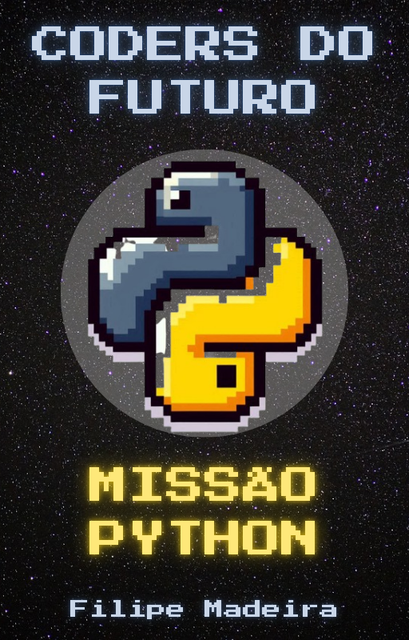

# Coders do Futuro: Missão Python 🚀

## 📚 Sobre o Projeto

**Coders do Futuro: Missão Python** é um ebook divertido e educativo criado com auxilio da IA para introduzir crianças de 10+ anos no mundo da programação com Python! Através de analogias espaciais, exemplos práticos e projetos lúdicos, transformamos conceitos complexos em aventuras interativas.

[Clique para ler](./output/coders%20do%20futuro_missao_python.pdf)

## 💻 Tecnologias utilizadas no projeto

- [ChatGPT](https://chatgpt.com/)
- [Deepseek](https://chat.deepseek.com/)
- [Canva](https://www.canva.com/)
- [Bing Image Creator](https://www.bing.com/images/create)

## ✨ **Destaques:**

- ✅ Explicações simples com linguagem infantil
- ✅ 10+ projetos prontos para usar
- ✅ Analogias com foguetes, planetas e missões espaciais
- ✅ Foco em aplicações reais e criativas

## 🧠 Prompts

| Ação                                               | Prompt                                                                                                                                                                                                                                                                                                                                                                                                                               |
| -------------------------------------------------- | ------------------------------------------------------------------------------------------------------------------------------------------------------------------------------------------------------------------------------------------------------------------------------------------------------------------------------------------------------------------------------------------------------------------------------------ |
| Título (ChatGPT)                                   | Crie um título de um ebook sobre o tema de Python para crianças de 10 anos, o ebook é do nicho de programação e o subnicho é de Python. Me liste 5 variações de títulos.                                                                                                                                                                                                                                                             |
| Conteúdo (Deepseek)                                | Faça um texto para ebook, com foco em Python para crianças de 10 anos, quero que ele funcione como um manual para ajudar a crianças começarem no mundo da programação Título do E-book: Coders do futuro: Missão Python {REGRAS} Explique sempre de uma maneira simples Deixe o texto enxuto Sempre traga exemplos de código em contextos reais Sempre deixe um título sugestivo por tópico Desejo que ele seja um material de valor |
| Capa (Bing Image Creator)                          | Python symbol, pixelart                                                                                                                                                                                                                                                                                                                                                                                                              |
| Exemplo de ilustração interna (Bing Image Creator) | Rocket in space, cartoonish                                                                                                                                                                                                                                                                                                                                                                                                          |

## 📖 Sumário do Conteúdo

1. 🪐 Bem-vindo, Explorador Digital!

2. 🚀 Preparando a Nave: Instalando Python

3. ✨ Seu Primeiro Comando: O Mágico print()

4. 🧳 Variáveis: Suas Caixas Mágicas

5. 👽 Conversando com o Computador: input()

6. 🔀 Tomando Decisões com if

7. 🔁 Loops: Repetições Mágicas!

8. 🪐 Listas: Sua Coleção de Planetas

9. 🧪 Funções: Fórmulas Secretas

10. 🎮 Missão Final: Jogo "Adivinhe o Número"

(+ Bônus exclusivos: Desafios extras e recursos online)

## 👩‍🚀 Sobre a Criação

Este ebook é resultado de uma colaboração especial entre tecnologia e cuidado humano:

- 🤖 IA Generativa: Responsável pelo conteúdo inicial e exemplos

- 🧑‍🏫 Revisão Humana

- 🎨 Diagramação Profissional

## 📚 Materiais

- Imagens utilizadas em `images`
- Ebook gerado durante as aulas em `output`

⌨️ com 💜 por [Filipe Madeira](https://github.com/FilipeMadeira13)
